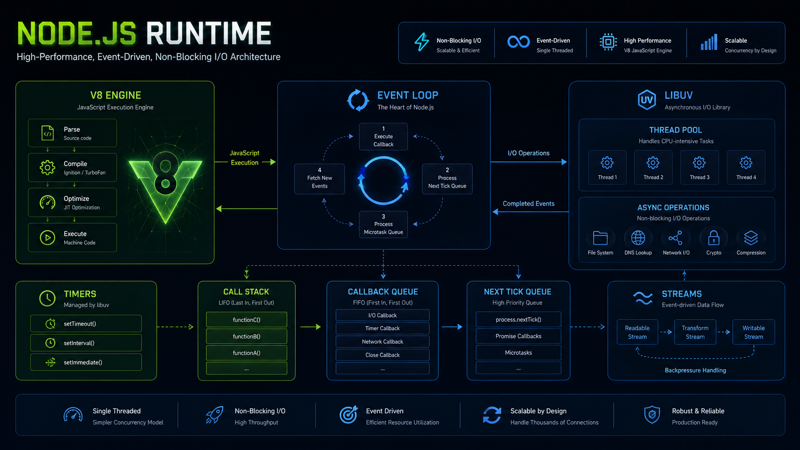
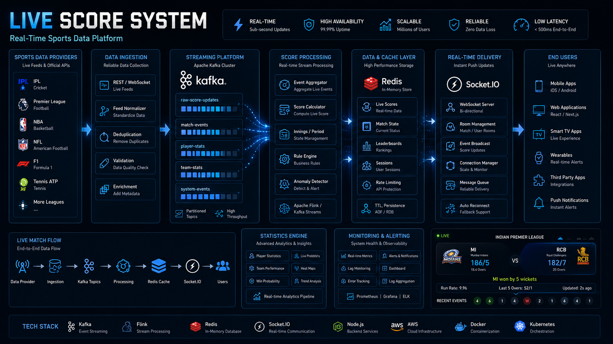
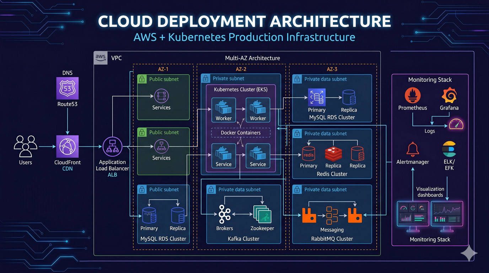

# 🚀 Node.js System Design


> Production-Grade Node.js System Design, Backend Architecture, Distributed Systems, Scalability Patterns, and Real-World Engineering Case Studies.

---

## 📌 Repository Overview

This repository is a comprehensive backend engineering and system design knowledge base focused on building scalable, reliable, and production-ready systems using Node.js and modern distributed architecture patterns.

It is designed for:

- Backend Engineers
- Software Engineers
- Full Stack Developers
- Technical Leads
- Engineering Managers
- System Design Interview Preparation
- Senior Engineering Career Growth

The repository covers real-world architectural concepts used in:

- Ecommerce Platforms
- Fantasy Sports Applications
- Payment Systems
- Notification Platforms
- Real-Time Live Score Systems
- Event Driven Architectures
- Distributed Systems

---

## 🏗 Architecture Gallery

### System Architecture


### Node.js Runtime



### Redis Architecture


### Kafka Architecture


### RabbitMQ Architecture


### Ecommerce Platform


### Fantasy Sports Platform


### Payment System


### Live Score Platform



### Deployment Architecture



---

# 🎯 Learning Roadmap

Recommended learning sequence:

```text
Node.js Fundamentals
        ↓
API Design
        ↓
Authentication & Authorization
        ↓
Caching with Redis
        ↓
RabbitMQ Messaging
        ↓
Kafka Event Streaming
        ↓
Distributed Systems
        ↓
System Design Case Studies
        ↓
Production Engineering