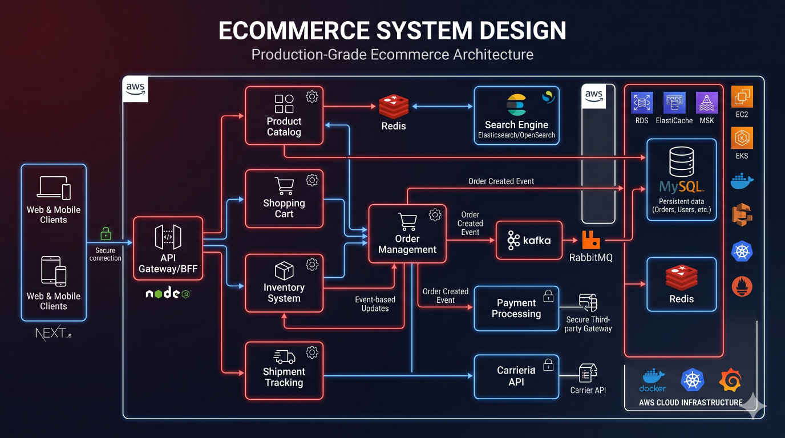

# Ecommerce System Design Case Study




---

# Executive Summary

This case study demonstrates the architecture of a production-grade ecommerce platform designed to support:

* Millions of users
* High traffic events
* Flash sales
* Real-time inventory updates
* Secure payments
* Global scalability

The architecture is inspired by real-world enterprise ecommerce systems and focuses on scalability, reliability, observability, and operational excellence.

This repository intentionally avoids company-specific code and focuses on architecture and engineering principles.

---

# Business Requirements

The platform must support:

### Customer Features

* User registration
* Authentication
* Product discovery
* Product search
* Wishlist
* Shopping cart
* Checkout
* Order tracking
* Reviews and ratings

---

### Admin Features

* Product management
* Inventory management
* Order management
* Coupon management
* Customer management
* Reporting

---

### Operational Requirements

* High availability
* Horizontal scalability
* Fault tolerance
* Secure payments
* Real-time inventory
* Fast page loads

---

# Non-Functional Requirements

Target metrics:

| Metric                | Target  |
| --------------------- | ------- |
| Availability          | 99.9%+  |
| API Latency           | < 200ms |
| Cache Hit Ratio       | > 90%   |
| Checkout Success Rate | > 99%   |
| Inventory Accuracy    | 100%    |
| Payment Reliability   | 99.99%  |

---

# High-Level Architecture

```text
Users
 ↓
CDN
 ↓
Load Balancer
 ↓
API Gateway
 ↓
Microservices
 ↓
Databases
Caches
Queues
```

---

# Service Architecture

Core services:

```text
User Service

Catalog Service

Inventory Service

Cart Service

Order Service

Payment Service

Notification Service
```

Each service owns its data and business logic.

---

# Frontend Layer

Technology options:

* Next.js
* React.js
* TypeScript

Responsibilities:

* Product browsing
* Search
* Checkout
* Account management

---

# API Gateway

Responsibilities:

* Authentication
* Routing
* Rate limiting
* Request aggregation
* Security controls

Benefits:

* Unified entry point
* Simplified client communication

---

# User Service

Responsibilities:

* Registration
* Login
* Profile management
* Address management

Storage:

```text
MySQL
```

Authentication:

```text
JWT
```

---

# Catalog Service

Responsibilities:

* Products
* Categories
* Brands
* Product details

Storage:

```text
MySQL
```

Cache:

```text
Redis
```

---

# Search Architecture

Large platforms use:

```text
Elasticsearch
```

Flow:

```text
Catalog Updates
       ↓
Search Index
       ↓
Search API
```

Benefits:

* Fast product discovery

---

# Product Caching

Frequently accessed data:

```text
Products

Categories

Brands
```

stored in:

```text
Redis
```

Benefits:

* Faster responses
* Reduced database load

---

# Inventory Service

Responsibilities:

* Stock tracking
* Reservations
* Availability validation

Critical requirement:

```text
Never Oversell
```

---

# Inventory Architecture

```text
Inventory API
       ↓
Redis Lock
       ↓
Database
```

Benefits:

* Race condition prevention

---

# Cart Service

Responsibilities:

* Add to cart
* Remove from cart
* Quantity updates

Storage:

```text
Redis
```

Benefits:

* Fast user experience
* Reduced database writes

---

# Order Service

Responsibilities:

* Order creation
* Order tracking
* Order status updates

Storage:

```text
MySQL
```

Events:

```text
ORDER_CREATED
```

published to Kafka.

---

# Payment Service

Responsibilities:

* Payment initiation
* Verification
* Settlement tracking

Flow:

```text
Order
 ↓
Payment Gateway
 ↓
Verification
 ↓
Success
```

Events:

```text
PAYMENT_SUCCESS
```

---

# Payment Reliability

Important rules:

* Idempotency
* Retry handling
* Audit logging

Benefits:

* Financial correctness

---

# Notification Service

Channels:

```text
Email

SMS

Push Notifications
```

Events:

```text
ORDER_CREATED

ORDER_SHIPPED

PAYMENT_SUCCESS
```

processed asynchronously.

---

# Event-Driven Architecture

Kafka Topics:

```text
orders

payments

notifications

inventory
```

Benefits:

* Loose coupling
* Independent scaling

---

# Database Architecture

Primary database:

```text
MySQL
```

---

Read scaling:

```text
Primary
 ↓
Replicas
```

Benefits:

* Improved performance

---

# Redis Architecture

Stores:

```text
Sessions

Carts

Product Cache

Inventory Cache
```

Benefits:

* Low latency
* Reduced DB load

---

# Inventory Reservation Flow

```text
Checkout
 ↓
Acquire Lock
 ↓
Reserve Stock
 ↓
Create Order
 ↓
Release Lock
```

Prevents overselling.

---

# Checkout Flow

```text
User
 ↓
Cart
 ↓
Inventory Validation
 ↓
Payment
 ↓
Order Creation
```

Critical business workflow.

---

# Order Lifecycle

```text
ORDER_CREATED

ORDER_PAID

ORDER_PACKED

ORDER_SHIPPED

ORDER_DELIVERED
```

State transitions tracked carefully.

---

# Search Scaling

Architecture:

```text
Catalog Service
 ↓
Kafka
 ↓
Search Index
```

Benefits:

* Near real-time indexing

---

# File Storage

Assets:

```text
Product Images
```

stored in:

```text
AWS S3
```

Benefits:

* Scalability
* Durability

---

# CDN Layer

Static content served via:

```text
CloudFront
```

Benefits:

* Faster global delivery

---

# Flash Sale Architecture

Traffic spikes:

```text
10x–100x Normal Load
```

Strategies:

* Redis caching
* Queue buffering
* Auto scaling
* Inventory locking

---

# Observability

Metrics:

```text
API Latency

Checkout Success

Inventory Accuracy

Order Throughput
```

Tools:

* Prometheus
* Grafana

---

# Logging

Track:

* API requests
* Payment events
* Order updates
* Security events

Benefits:

* Faster debugging

---

# Security Architecture

Controls:

* JWT Authentication
* TLS Encryption
* Rate Limiting
* WAF Protection

Benefits:

* Platform protection

---

# Disaster Recovery

Strategies:

* Database backups
* Multi-AZ deployment
* Infrastructure automation
* Replayable Kafka events

Benefits:

* Faster recovery

---

# Common Production Challenges

### Inventory Overselling

Solution:

```text
Redis Distributed Locks
```

---

### Checkout Latency

Solution:

```text
Caching
```

---

### Payment Failures

Solution:

```text
Idempotency
```

---

### Search Performance

Solution:

```text
Dedicated Search Engine
```

---

# Scaling Journey

### Stage 1

```text
Monolith
```

---

### Stage 2

```text
Modular Monolith
```

---

### Stage 3

```text
Microservices
```

---

### Stage 4

```text
Event-Driven Platform
```

---

# System Design Interview Discussion

Common questions:

### How would you prevent overselling?

Use inventory reservations and distributed locking.

---

### How would you scale search?

Dedicated search infrastructure and indexing pipelines.

---

### How would you handle payment retries?

Idempotent payment processing.

---

### How would you support flash sales?

Caching, queue buffering, and autoscaling.

---

# Engineering Lessons

* Inventory consistency is critical.
* Event-driven systems improve scalability.
* Redis significantly reduces database load.
* Payment systems require idempotency.
* Observability is mandatory.
* Search should scale independently.
* Reliability must be designed from the beginning.

---

# Key Takeaways

* Ecommerce systems combine transactional and high-read workloads.
* Redis, Kafka, and MySQL are foundational technologies.
* Inventory and payment flows require special attention.
* Event-driven architecture improves scalability.
* Observability and fault tolerance are essential.
* Flash sales introduce unique scaling challenges.
* Production-grade ecommerce design is a common senior-level system design topic.

---

# Related Documents

* docs/architecture/ecommerce-architecture.md
* docs/architecture/payment-system.md
* docs/redis/distributed-locking.md
* docs/kafka/event-streaming.md

Related Diagram:

* diagrams/ecommerce-system.mmd
