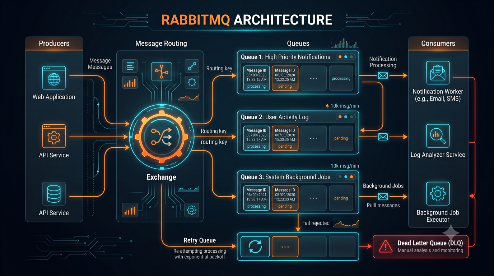

# RabbitMQ Message Ordering



---

# Overview

Message ordering is one of the most misunderstood topics in distributed systems and messaging architectures.

Many business workflows require messages to be processed in a specific sequence.

Examples:

```text id="o1r7m3"
ORDER_CREATED

PAYMENT_SUCCESS

ORDER_SHIPPED
```

If processed incorrectly:

```text id="k5m2q8"
ORDER_SHIPPED

ORDER_CREATED
```

the system enters an inconsistent state.

Understanding message ordering is critical when designing production-grade RabbitMQ architectures.

---

# Why Ordering Matters

Some business events depend on previous events.

Example:

```text id="r8m4q1"
Bank Account Created
```

must happen before:

```text id="t2q7m5"
Money Deposited
```

Otherwise:

```text id="v6m3q9"
Data Corruption
```

or

```text id="p1q8m4"
Business Failure
```

can occur.

---

# What RabbitMQ Guarantees

RabbitMQ provides:

```text id="m7q2r6"
FIFO
```

behavior within a queue.

Meaning:

```text id="n4m8q3"
Message 1

Message 2

Message 3
```

are delivered in order.

---

However:

Important caveats exist.

---

# Single Producer + Single Consumer

Architecture:

```text id="w8q3m1"
Producer
 ↓
Queue
 ↓
Consumer
```

Ordering is preserved.

Example:

```text id="k2m7q5"
1
2
3
4
5
```

Processed sequentially.

---

# Multiple Consumers

Architecture:

```text id="u5q1m8"
Queue
 ↓
Consumer A

Consumer B

Consumer C
```

Messages distributed across workers.

Example:

```text id="r3m8q2"
Message 1 → A

Message 2 → B

Message 3 → C
```

---

Problem:

Completion order may differ.

---

Example:

```text id="x7m2q4"
Message 1 → 10 sec

Message 2 → 1 sec
```

Result:

```text id="v4q8m1"
Message 2 Completes First
```

Ordering effectively breaks.

---

# Producer Ordering

Single producer:

```text id="j8m3q5"
1
2
3
```

Typically preserved.

---

Multiple producers:

```text id="p2q7m4"
Producer A

Producer B
```

Messages may interleave.

Example:

```text id="n6m1q8"
A1

B1

A2

B2
```

Global ordering is not guaranteed.

---

# Ordering Challenge Example

Ecommerce:

Events:

```text id="t5m9q2"
ORDER_CREATED

ORDER_CANCELLED
```

If cancellation processes first:

```text id="y1q6m7"
Invalid State
```

occurs.

---

# Payment Example

Events:

```text id="m8q4r3"
PAYMENT_PENDING

PAYMENT_SUCCESS

PAYMENT_REFUNDED
```

Incorrect ordering causes:

* Financial inconsistencies
* Reporting errors

---

# Notification Example

Events:

```text id="u3m7q9"
Welcome Email

Account Verification
```

Wrong order creates poor user experience.

---

# Why Ordering Breaks

Distributed systems introduce:

* Network delays
* Retries
* Parallel processing
* Failures

These factors affect message completion order.

---

# Consumer Parallelism

Example:

```text id="k7m2q5"
Consumer A
```

Processes:

```text id="r4m8q1"
30 Seconds
```

---

Consumer B:

```text id="v9q3m6"
1 Second
```

Result:

Messages finish out of sequence.

---

# Retry Impact

Scenario:

```text id="n5m1q7"
Message 1
```

fails.

Message:

```text id="x8q4m2"
Message 2
```

succeeds.

Result:

```text id="t2m7q5"
Message 2 First
```

Ordering changes.

---

# Preserving Ordering

Several strategies exist.

---

# Strategy 1: Single Consumer

Architecture:

```text id="w3m8q4"
Queue
 ↓
One Consumer
```

Benefits:

* Strong ordering

Drawback:

* Limited throughput

---

# Strategy 2: Partition By Entity

Example:

```text id="k9m2q7"
order_id
```

All events for same order routed consistently.

Architecture:

```text id="u7q1m5"
Order 101
 ↓
Queue A

Order 102
 ↓
Queue B
```

Benefits:

* Per-entity ordering

---

# Strategy 3: Sequence Numbers

Messages contain:

```json id="p5m8q3"
{
  "sequence": 101
}
```

Consumer validates order.

Benefits:

* Detection of inconsistencies

---

# Strategy 4: Event Versioning

Example:

```json id="r2q7m4"
{
  "version": 3
}
```

Consumers ignore older versions.

Benefits:

* State protection

---

# Saga Workflows

Distributed transactions often require ordering.

Example:

```text id="m6q1r8"
Create Order

Reserve Inventory

Capture Payment
```

Wrong ordering breaks business processes.

---

# Ecommerce Example

Architecture:

```text id="t8m3q5"
Order Service
 ↓
RabbitMQ
 ↓
Order Processor
```

Single order should maintain sequence.

---

# Payment Example

Flow:

```text id="x4q9m2"
Payment Initiated

Payment Completed

Payment Settled
```

Ordering is mandatory.

---

# Fantasy Sports Example

Events:

```text id="y7m2q4"
Contest Joined

Contest Locked

Contest Settled
```

Out-of-order processing creates incorrect results.

---

# Notification Example

Flow:

```text id="u1q8m6"
User Registered
 ↓
Verification Email
 ↓
Welcome Email
```

Sequence matters.

---

# FIFO Queue Design

Best for:

```text id="n8m4q2"
Low Throughput
```

Workloads requiring strict order.

Examples:

* Financial processing
* Account updates

---

# High Throughput Tradeoff

Architecture:

```text id="p7m3q1"
Multiple Consumers
```

Benefits:

* Scalability

Tradeoff:

```text id="v2q8m5"
Ordering Weakens
```

Common distributed systems compromise.

---

# RabbitMQ vs Kafka

Important interview topic.

RabbitMQ:

```text id="w5m1q7"
Queue-Based
```

Ordering weaker with many consumers.

---

Kafka:

```text id="t9q4m2"
Partition-Based
```

Ordering preserved within partitions.

---

Kafka often preferred for:

* Event sourcing
* Financial streams
* Real-time pipelines

---

# Monitoring Ordering Issues

Track:

## Processing Delays

Detect slow consumers.

---

## Retry Counts

Ordering risk indicator.

---

## Consumer Lag

Backlog visibility.

---

## Event Sequence Gaps

Potential consistency issue.

---

# Security Considerations

## Idempotency

Protect against duplicates.

---

## Validation

Verify sequence correctness.

---

## Audit Logs

Track event flow.

---

## Replay Protection

Prevent stale events from corrupting state.

---

# Common Mistakes

## Assuming Global Ordering

RabbitMQ does not guarantee this.

---

## Excessive Parallelism

Can break workflows.

---

## Ignoring Retries

Ordering may change.

---

## No Sequence Tracking

Harder debugging.

---

## No Idempotency

Creates duplicate effects.

---

# Common Interview Questions

### Does RabbitMQ guarantee ordering?

Within a queue, yes, but parallel consumers can affect processing order.

---

### Why does ordering break?

Retries, concurrency, failures, and network delays.

---

### How do you preserve ordering?

Single consumers, partitioning, sequence numbers, and workflow design.

---

### Why is ordering important?

Many business processes depend on event sequence.

---

### RabbitMQ or Kafka for strict ordering?

Kafka typically provides stronger partition-based ordering guarantees.

---

### What role does idempotency play?

It protects systems from duplicate or reordered processing.

---

# Production Lessons

* Message ordering is a business requirement, not just a technical concern.
* Throughput and ordering often compete.
* Single consumers provide strongest ordering guarantees.
* Kafka is often preferred for strict ordered event streams.
* Sequence numbers improve observability.
* Idempotency is mandatory.
* Ordering assumptions should be documented explicitly.

---

# Key Takeaways

* RabbitMQ provides FIFO delivery but ordering can be affected by parallel processing.
* Distributed systems naturally introduce ordering challenges.
* Business-critical workflows often require explicit ordering strategies.
* Partitioning and sequence numbers help maintain consistency.
* Kafka offers stronger ordering guarantees for many event-streaming use cases.
* Understanding ordering tradeoffs is essential for system design interviews.
* Message ordering is a foundational concept in distributed architectures.

---

# Related Documents

* docs/rabbitmq/rabbitmq-patterns.md
* docs/rabbitmq/retries.md
* docs/architecture/event-driven-architecture.md
* docs/architecture/distributed-systems.md

Related Diagram:

* diagrams/rabbitmq-architecture.mmd
