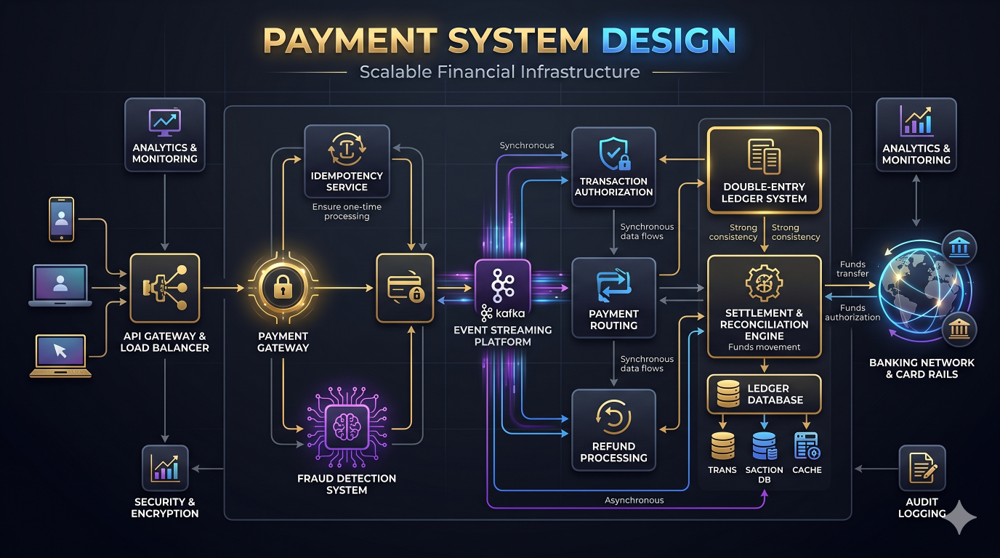

# Ecommerce System Architecture


---

# Overview

This document showcases a production-grade ecommerce architecture designed for scalability, reliability, performance, and maintainability.

The system is capable of supporting:

* Millions of users
* High order volumes
* Flash sales
* Secure payments
* Real-time inventory updates
* Global product delivery
* Event-driven processing

The architecture follows modern backend engineering practices using Node.js, Redis, Kafka, RabbitMQ, MySQL, AWS, Docker, and Kubernetes.

---

# Business Capabilities

The platform supports:

## Customer Features

* User Registration
* Authentication
* Product Discovery
* Product Search
* Wishlist
* Shopping Cart
* Checkout
* Order Tracking
* Reviews & Ratings

---

## Admin Features

* Product Management
* Category Management
* Inventory Management
* Coupon Management
* Order Management
* Shipment Management
* Reports & Analytics

---

# High-Level Architecture


```text
Users
 ↓
CDN
 ↓
Load Balancer
 ↓
API Gateway
 ↓
Microservices
 ↓
Databases
Caches
Message Brokers
```

---

# Frontend Layer

Technology Stack:

```text
Next.js

React.js

TypeScript
```

Responsibilities:

* Product Listing
* Product Details
* Cart Management
* Checkout
* User Accounts

Benefits:

* SEO Friendly
* Fast Performance
* Better User Experience

---

# API Gateway

Responsibilities:

* Authentication
* Authorization
* Routing
* Rate Limiting
* Request Aggregation

Benefits:

* Single Entry Point
* Security Layer
* Traffic Management

---

# Core Services

```text
User Service

Catalog Service

Inventory Service

Cart Service

Order Service

Payment Service

Shipment Service

Notification Service
```

Each service owns its business domain and database responsibilities.

---

# User Service

Responsibilities:

* Registration
* Login
* Address Management
* Profile Management

Storage:

```text
MySQL
```

Authentication:

```text
JWT
```

---

# Catalog Service


Responsibilities:

* Products
* Categories
* Variants
* Product Images
* Product Search

Storage:

```text
MySQL
```

Cache:

```text
Redis
```

Benefits:

* Fast Product Browsing
* Reduced Database Load

---

# Product Search Architecture

Flow:

```text
Catalog Service
       ↓
Kafka
       ↓
Search Index
       ↓
Search API
```

Technology:

```text
Elasticsearch

OpenSearch
```

Benefits:

* Fast Search
* Scalable Indexing

---

# Shopping Cart Architecture

Responsibilities:

* Add To Cart
* Remove From Cart
* Update Quantity

Storage:

```text
Redis
```

Benefits:

* Low Latency
* Fast User Experience

---

# Inventory Service


Responsibilities:

* Stock Management
* Inventory Validation
* Inventory Reservation

Critical Requirement:

```text
Never Oversell
```

Architecture:

```text
Checkout
    ↓
Inventory Validation
    ↓
Distributed Lock
    ↓
Inventory Reservation
```

Benefits:

* Inventory Accuracy
* Consistency

---

# Distributed Locking

Technology:

```text
Redis
```

Used For:

* Inventory Reservation
* Flash Sales
* Checkout Processing

Benefits:

* Race Condition Prevention
* Data Consistency

---

# Order Service

Responsibilities:

* Order Creation
* Order Status Updates
* Order Tracking
* Order History

Events:

```text
ORDER_CREATED

ORDER_CONFIRMED

ORDER_SHIPPED

ORDER_DELIVERED
```

Published to Kafka.

---

# Order Lifecycle

```text
Cart
 ↓
Checkout
 ↓
Payment
 ↓
Order Created
 ↓
Shipment
 ↓
Delivery
```

Benefits:

* Traceability
* Visibility

---

# Payment Service



Responsibilities:

* Payment Initiation
* Verification
* Refunds
* Transaction Tracking

Architecture:

```text
Order
 ↓
Payment Gateway
 ↓
Verification
 ↓
Success
```

Critical Principles:

* Idempotency
* Audit Logging
* Retry Handling

Benefits:

* Financial Correctness

---

# Payment Event Flow

```text
PAYMENT_SUCCESS
        ↓
Kafka
        ↓
Order Service

Notification Service

Analytics Service
```

Benefits:

* Loose Coupling
* Scalability

---

# Shipment Service

Responsibilities:

* Shipment Creation
* Tracking Updates
* Delivery Status

Events:

```text
SHIPMENT_CREATED

OUT_FOR_DELIVERY

DELIVERED
```

Benefits:

* Real-Time Tracking

---

# Notification Service


Channels:

```text
Email

SMS

Push Notification
```

Events:

```text
ORDER_CREATED

PAYMENT_SUCCESS

SHIPMENT_CREATED
```

Architecture:

```text
Application
      ↓
RabbitMQ
      ↓
Notification Workers
```

Benefits:

* Fast API Responses
* Independent Scaling

---

# Kafka Architecture


Topics:

```text
orders

payments

inventory

shipments

notifications
```

Benefits:

* Event Streaming
* Replayability
* Scalability

---

# Redis Architecture


Used For:

```text
Product Cache

Category Cache

Inventory Cache

User Sessions

Shopping Cart

Rate Limiting
```

Benefits:

* Low Latency
* Reduced Database Load

---

# Database Architecture

Primary Database:

```text
MySQL
```

Stores:

* Users
* Products
* Orders
* Payments
* Inventory

Read Scaling:

```text
Primary
 ↓
Read Replicas
```

Benefits:

* Better Query Performance

---

# File Storage

Product ../../assets:

```text
Images

Documents

Media
```

Stored In:

```text
AWS S3
```

Benefits:

* High Durability
* Unlimited Scaling

---

# CDN Layer

Technology:

```text
CloudFront
```

Responsibilities:

* Image Delivery
* Static Asset Delivery

Benefits:

* Faster Global Access
* Reduced Origin Load

---

# Flash Sale Architecture

Traffic Pattern:

```text
10x–100x Traffic Increase
```

Strategies:

* Redis Caching
* Queue Buffering
* Distributed Locking
* Autoscaling

Benefits:

* Stable Checkout Experience

---

# Event Driven Architecture

Flow:

```text
Order Service
      ↓
Kafka
      ↓
Inventory Service

Analytics Service

Notification Service

Shipment Service
```

Benefits:

* Loose Coupling
* Independent Deployments
* Horizontal Scalability

---

# Security Architecture

Controls:

```text
JWT Authentication

TLS Encryption

RBAC

Rate Limiting

WAF Protection
```

Benefits:

* Secure Transactions
* Platform Protection

---

# Monitoring & Observability

Metrics:

```text
Checkout Success Rate

Order Throughput

Payment Success Rate

Inventory Accuracy

API Latency
```

Tools:

* Prometheus
* Grafana
* OpenTelemetry

Benefits:

* Faster Incident Resolution

---

# Disaster Recovery

Strategies:

```text
Database Backups

Kafka Replay

Multi-AZ Deployment

Infrastructure As Code
```

Benefits:

* Faster Recovery
* Reduced Downtime

---

# Scaling Strategies

## Stage 1

```text
Monolith
```

---

## Stage 2

```text
Modular Monolith
```

---

## Stage 3

```text
Microservices
```

---

## Stage 4

```text
Event Driven Architecture
```

---

## Stage 5

```text
Global Scale Platform
```

---

# Engineering Lessons

* Inventory consistency is critical.
* Payments require idempotency.
* Redis significantly improves performance.
* Kafka enables scalable service communication.
* RabbitMQ is excellent for background jobs.
* Search should scale independently.
* Observability must be built from day one.
* Flash sales require special architectural considerations.

---

# Key Takeaways

* Ecommerce platforms combine transactional and high-read workloads.
* Redis, Kafka, RabbitMQ, and MySQL are foundational technologies.
* Inventory and payment workflows require strong consistency.
* Event-driven architecture improves scalability.
* Search and notifications should be independent systems.
* Observability is mandatory for production environments.
* Ecommerce architecture is one of the most common senior-level system design interview topics.

---

# Related Documents

* docs/case-studies/ecommerce-case-study.md
* docs/architecture/ecommerce-architecture.md
* docs/architecture/payment-system.md
* docs/redis/distributed-locking.md
* docs/kafka/event-streaming.md

Related Diagram:

* diagrams/ecommerce-system.mmd
