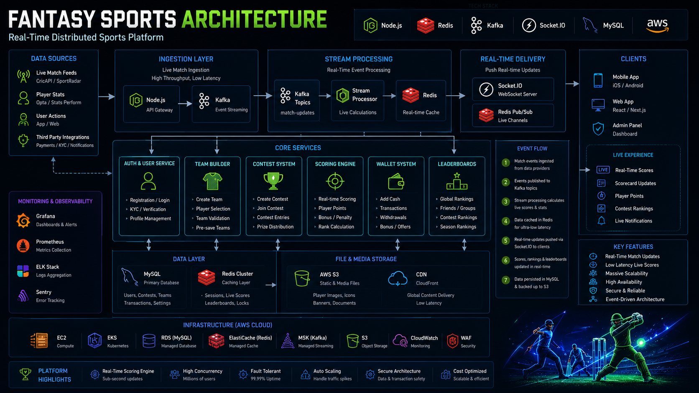
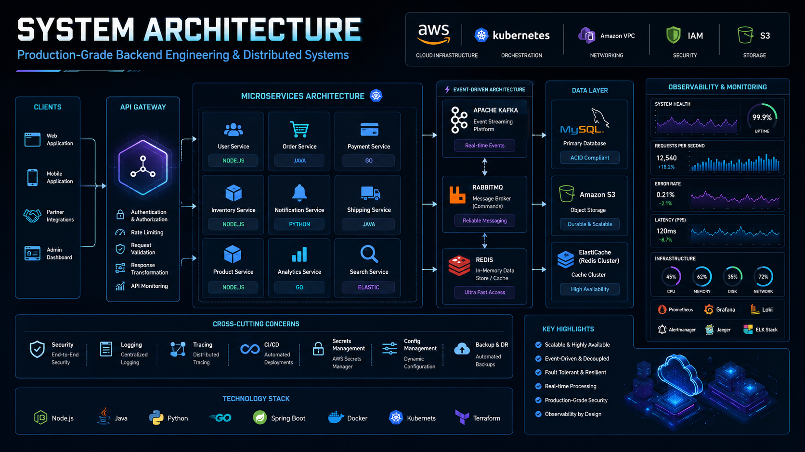
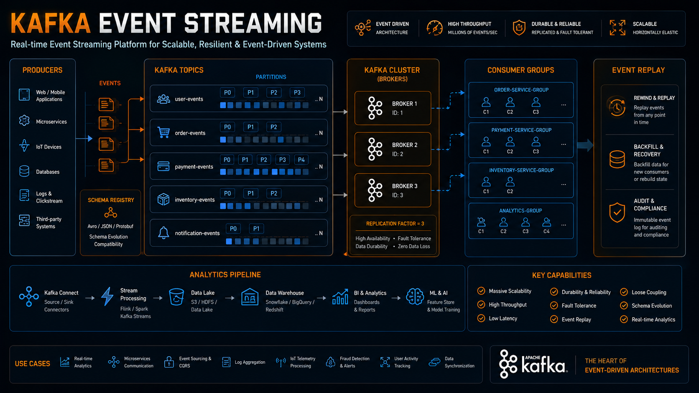
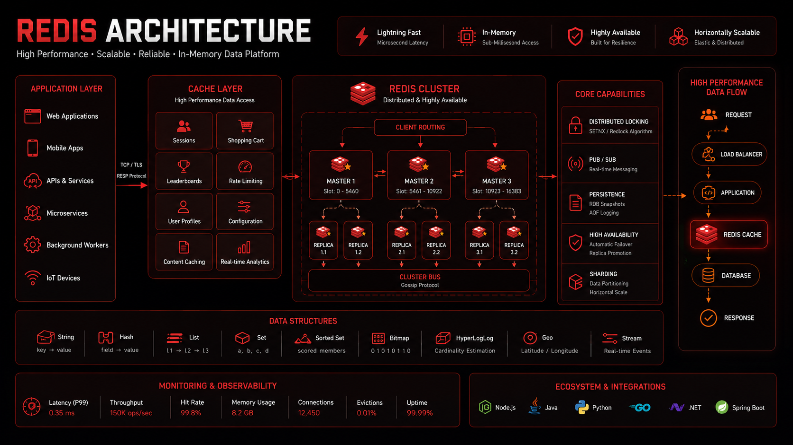

# Fantasy Sports System Architecture





---

# Overview

This document showcases the architecture of a production-grade fantasy sports platform capable of supporting:

* Millions of users
* Real-time score updates
* Contest participation
* Wallet transactions
* Live leaderboards
* Match settlements
* High concurrency traffic spikes

Fantasy sports systems are among the most technically challenging backend architectures because they combine:

* Real-time event processing
* Financial transactions
* Massive traffic spikes
* Low latency requirements
* High consistency requirements

This architecture demonstrates how modern fantasy sports platforms achieve scalability, reliability, and real-time performance.

---

# Core Business Features

## User Features

* Registration & Login
* Team Creation
* Contest Joining
* Wallet Management
* Live Score Tracking
* Real-Time Leaderboards
* Contest History
* Withdrawals

---

## Admin Features

* Match Management
* Contest Management
* Settlement Controls
* Wallet Operations
* Reporting & Analytics
* User Management

---

# High-Level Architecture


```text
Users
 ↓
CDN
 ↓
Load Balancer
 ↓
API Gateway
 ↓
Microservices
 ↓
Kafka
Redis
MySQL
Socket.IO
```

---

# Core Services

```text
User Service

Match Service

Contest Service

Team Service

Scoring Service

Leaderboard Service

Wallet Service

Settlement Service

Notification Service
```

Benefits:

* Independent deployments
* Better scalability
* Domain ownership

---

# User Service

Responsibilities:

* Registration
* Login
* Profile Management
* KYC Status
* User Preferences

Storage:

```text
MySQL
```

Authentication:

```text
JWT
```

---

# Match Service

Responsibilities:

* Match Fixtures
* Team Information
* Venue Details
* Match Status

Data Source:

```text
Sports Data Provider
```

Benefits:

* Centralized match information
* Real-time updates

---

# Team Creation System

Responsibilities:

* Squad Validation
* Credit Validation
* Captain Selection
* Vice Captain Selection

Validations:

```text
Maximum Players

Role Limits

Credit Limits

Team Combination Rules
```

Benefits:

* Fair Gameplay
* Contest Integrity

---

# Contest Service


Responsibilities:

* Contest Creation
* Contest Joining
* Slot Management
* Prize Distribution

Critical Requirement:

```text
Prevent Overbooking
```

Architecture:

```text
User
 ↓
Join Contest
 ↓
Distributed Lock
 ↓
Capacity Validation
 ↓
Reserve Slot
```

Benefits:

* Accurate Contest Capacity
* Consistent Data

---

# Redis Distributed Locking

Technology:

```text
Redis
```

Used For:

* Contest Joins
* Team Updates
* Wallet Transactions

Benefits:

* Race Condition Prevention
* Data Consistency

---

# Wallet Service


Responsibilities:

```text
Deposits

Withdrawals

Contest Entries

Prize Credits

Refunds
```

Architecture:

```text
Wallet API
      ↓
Ledger System
      ↓
Database
```

Principles:

* Immutable Transactions
* Auditability
* Idempotency

Benefits:

* Financial Accuracy

---

# Live Match Data Pipeline

Source:

```text
Sports Data Provider
```

Flow:

```text
Provider
 ↓
Kafka
 ↓
Scoring Service
 ↓
Redis
 ↓
Socket.IO
 ↓
Users
```

Benefits:

* Real-Time Updates
* Horizontal Scalability

---

# Kafka Architecture



Topics:

```text
match-events

score-events

leaderboard-events

wallet-events

notification-events
```

Benefits:

* Event Streaming
* Replayability
* Scalability

---

# Scoring Engine

Responsibilities:

* Event Processing
* Fantasy Point Calculation
* Rule Execution

Match Events:

```text
RUN

FOUR

SIX

WICKET

CATCH

RUNOUT

STUMPING
```

Converted Into:

```text
Fantasy Points
```

Benefits:

* Automated Scoring
* Real-Time Updates

---

# Fantasy Point Pipeline

```text
Match Event
      ↓
Kafka
      ↓
Scoring Engine
      ↓
Player Points
      ↓
Leaderboard Update
```

Benefits:

* Low Latency
* High Throughput

---

# Leaderboard Architecture



Technology:

```text
Redis Sorted Sets
```

Flow:

```text
Scoring Service
      ↓
Redis Leaderboard
      ↓
Leaderboard API
```

Benefits:

* Instant Rankings
* Millions of Updates

---

# Real-Time Communication

Technology:

```text
Socket.IO
```

Architecture:

```text
Kafka
 ↓
Redis Pub/Sub
 ↓
Socket Servers
 ↓
Users
```

Benefits:

* Real-Time User Experience
* Massive Concurrent Connections

---

# Contest Settlement System

Critical Workflow:

```text
Match End
 ↓
Score Finalization
 ↓
Leaderboard Finalization
 ↓
Prize Calculation
 ↓
Wallet Credit
```

Requirements:

* Accuracy
* Reliability
* Idempotency

Benefits:

* Financial Correctness

---

# Settlement Architecture

```text
Scoring Service
      ↓
Settlement Engine
      ↓
Prize Calculation
      ↓
Wallet Credit
      ↓
Notification
```

Benefits:

* Automated Settlement
* Scalable Processing

---

# Notification Service


Events:

```text
MATCH_STARTED

CONTEST_JOINED

POINTS_UPDATED

CONTEST_WON
```

Channels:

```text
Email

SMS

Push Notifications
```

Benefits:

* User Engagement
* Real-Time Communication

---

# Redis Usage


Stores:

```text
Leaderboards

Match State

Contest Cache

Sessions

Rate Limits
```

Benefits:

* Low Latency
* Reduced Database Load

---

# Database Architecture

Primary Database:

```text
MySQL
```

Stores:

* Users
* Teams
* Contests
* Wallet Transactions
* Match Metadata

Read Scaling:

```text
Primary
 ↓
Read Replicas
```

Benefits:

* Better Query Performance

---

# Match Start Traffic Spike

Common Pattern:

```text
5 Minutes Before Match
```

Traffic Increase:

```text
10x–50x
```

Scaling Strategies:

* Redis Caching
* Autoscaling
* Queue Buffering
* Rate Limiting

Benefits:

* Stable User Experience

---

# Fraud Prevention

Controls:

```text
Device Monitoring

Velocity Checks

Wallet Audits

Duplicate Account Detection

Risk Scoring
```

Benefits:

* Platform Integrity
* Financial Protection

---

# Security Architecture

Controls:

```text
JWT Authentication

TLS Encryption

RBAC

Audit Logging
```

Benefits:

* User Protection
* Secure Transactions

---

# Monitoring & Observability

Critical Metrics:

```text
Score Latency

Leaderboard Latency

Contest Fill Rate

Wallet Accuracy

Settlement Success Rate
```

Tools:

* Prometheus
* Grafana
* OpenTelemetry

Benefits:

* Faster Incident Resolution

---

# Disaster Recovery

Strategies:

```text
Kafka Replay

Database Backups

Infrastructure Automation

Multi-AZ Deployment
```

Benefits:

* Faster Recovery
* Reduced Downtime

---

# Scaling Journey

## Stage 1

```text
Monolith
```

---

## Stage 2

```text
Modular Architecture
```

---

## Stage 3

```text
Microservices
```

---

## Stage 4

```text
Event Driven Architecture
```

---

## Stage 5

```text
Real-Time Distributed Platform
```

---

# Engineering Lessons

* Kafka enables scalable real-time event processing.
* Redis Sorted Sets are ideal for leaderboards.
* Distributed locking prevents contest corruption.
* Wallet systems require ledger-based architecture.
* Real-time systems demand strong observability.
* Traffic spikes must be anticipated.
* Settlement workflows must be idempotent.
* Socket.IO enables low-latency user experiences.

---

# Key Takeaways

* Fantasy sports platforms combine real-time systems with financial systems.
* Kafka, Redis, MySQL, RabbitMQ, and Socket.IO form the core technology stack.
* Contest joins require strong consistency.
* Leaderboards should use Redis Sorted Sets.
* Event-driven architecture improves scalability.
* Observability is critical for real-time platforms.
* Fantasy sports architecture is one of the most valuable system design interview topics.

---

# Related Documents

* docs/case-studies/fantasy-sports-case-study.md
* docs/architecture/fantasy-sports-architecture.md
* docs/architecture/live-score-system.md
* docs/kafka/event-streaming.md
* docs/redis/distributed-locking.md

Related Diagram:

* diagrams/fantasy-sports.mmd
